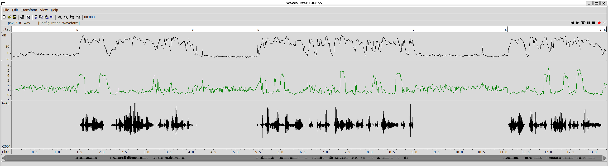
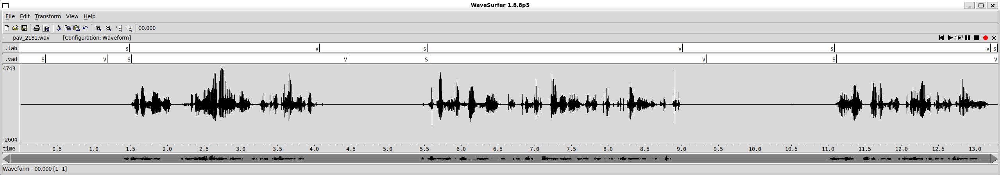
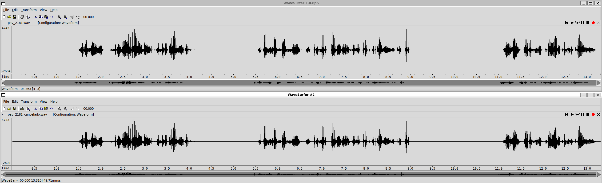
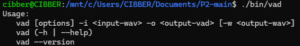

PAV - P2: detección de actividad vocal (VAD)
============================================

Esta práctica se distribuye a través del repositorio GitHub [Práctica 2](https://github.com/albino-pav/P2),
y una parte de su gestión se realizará mediante esta web de trabajo colaborativo.  Al contrario que Git,
GitHub se gestiona completamente desde un entorno gráfico bastante intuitivo. Además, está razonablemente
documentado, tanto internamente, mediante sus [Guías de GitHub](https://guides.github.com/), como
externamente, mediante infinidad de tutoriales, guías y vídeos disponibles gratuitamente en internet.


Inicialización del repositorio de la práctica.
----------------------------------------------

Para cargar los ficheros en su ordenador personal debe seguir los pasos siguientes:

*  Abra una cuenta GitHub para gestionar esta y el resto de prácticas del curso.
*  Cree un repositorio GitHub con el contenido inicial de la práctica (sólo debe hacerlo uno de los
  integrantes del grupo de laboratorio, cuya página GitHub actuará de repositorio central del grupo):
  -  Acceda la página de la [Práctica 2](https://github.com/albino-pav/P2).
  -  En la parte superior derecha encontrará el botón **`Fork`**. Apriételo y, después de unos segundos,
    se creará en su cuenta GitHub un proyecto con el mismo nombre (**P2**). Si ya tuviera uno con ese 
    nombre, se utilizará el nombre **P2-1**, y así sucesivamente.
*  Habilite al resto de miembros del grupo como *colaboradores* del proyecto; de este modo, podrán
  subir sus modificaciones al repositorio central:
  -  En la página principal del repositorio, en la pestaña **:gear:`Settings`**, escoja la opción 
    **Collaborators** y añada a su compañero de prácticas.
  -  Éste recibirá un email solicitándole confirmación. Una vez confirmado, tanto él como el
    propietario podrán gestionar el repositorio, por ejemplo: crear ramas en él o subir las
    modificaciones de su directorio local de trabajo al repositorio GitHub.
*  En la página principal del repositorio, localice el botón **Branch: master** y úselo para crear
  una rama nueva con los primeros apellidos de los integrantes del equipo de prácticas separados por
  guion (**fulano-mengano**).
*  Todos los miembros del grupo deben realizar su copia local en su ordenador personal.
  -  Copie la dirección de su copia del repositorio apretando en el botón **Clone or download**.
    Asegúrese de usar *Clone with HTTPS*.
  -  Abra una sesión de Bash en su ordenador personal y vaya al directorio **PAV**. Desde ahí, ejecute:

    ```.sh
    git clone dirección-del-fork-de-la-práctica
    ```

  -  Vaya al directorio de la práctica `cd P2`.

  -  Cambie a la rama **fulano-mengano** con la orden:

    ```.sh
    git checkout fulano-mengano
    ```

*  A partir de este momento, todos los miembros del grupo de prácticas pueden trabajar en su directorio
  local del modo habitual, usando el repositorio remoto en GitHub como repositorio central para el trabajo colaborativo
  de los distintos miembros del grupo de prácticas o como copia de seguridad.
  -  Puede *confirmar* versiones del proyecto en su directorio local con las órdenes siguientes:

    ```.sh
    git add .
    git commit -m "Mensaje del commit"
    ```

  -  Las versiones confirmadas, y sólo ellas, se almacenan en el repositorio y pueden ser accedidas en cualquier momento.

*  Para interactuar con el contenido remoto en GitHub es necesario que los cambios en el directorio local estén confirmados.

  -  Puede comprobar si el directorio está *limpio* (es decir, si la versión actual está confirmada) usando el comando
    `git status`.

  -  La versión actual del directorio local se sube al repositorio remoto con la orden:

    ```.sh
    git push
    ```

    *  Si el repositorio remoto contiene cambios no presentes en el directorio local, `git` puede negarse
      a subir el nuevo contenido.

      -  En ese caso, lo primero que deberemos hacer es incorporar los cambios presentes en el repositorio
        GitHub con la orden `git pull`.

      -  Es posible que, al hacer el `git pull` aparezcan *conflictos*; es decir, ficheros que se han modificado
        tanto en el directorio local como en el repositorio GitHub y que `git` no sabe cómo combinar.

      -  Los conflictos aparecen marcados con cadenas del estilo `>>>>`, `<<<<` y `====`. Los ficheros correspondientes
        deben ser editados para decidir qué versión preferimos conservar. Un editor avanzado, del estilo de Microsoft
        Visual Studio Code, puede resultar muy útil para localizar los conflictos y resolverlos.

      -  Tras resolver los conflictos, se ha de confirmar los cambios con `git commit` y ya estaremos en condiciones
        de subir la nueva versión a GitHub con el comando `git push`.


  -  Para bajar al directorio local el contenido del repositorio GitHub hay que ejecutar la orden:

    ```.sh
    git pull
    ```
  
    *  Si el repositorio local contiene cambios no presentes en el directorio remoto, `git` puede negarse a bajar
      el contenido de este último.

      -  La resolución de los posibles conflictos se realiza como se explica más arriba para
        la subida del contenido local con el comando `git push`.


*  Al final de la práctica, la rama **fulano-mengano** del repositorio GitHub servirá para remitir la
  práctica para su evaluación utilizando el mecanismo *pull request*.
  -  Vaya a la página principal de la copia del repositorio y asegúrese de estar en la rama
    **fulano-mengano**.
  -  Pulse en el botón **New pull request**, y siga las instrucciones de GitHub.


Entrega de la práctica.
-----------------------

Responda, en este mismo documento (README.md), los ejercicios indicados a continuación. Este documento es
un fichero de texto escrito con un formato denominado _**markdown**_. La principal característica de este
formato es que, manteniendo la legibilidad cuando se visualiza con herramientas en modo texto (`more`,
`less`, editores varios, ...), permite amplias posibilidades de visualización con formato en una amplia
gama de aplicaciones; muy notablemente, **GitHub**, **Doxygen** y **Facebook** (ciertamente, :eyes:).

En GitHub. cuando existe un fichero denominado README.md en el directorio raíz de un repositorio, se
interpreta y muestra al entrar en el repositorio.

Debe redactar las respuestas a los ejercicios usando Markdown. Puede encontrar información acerca de su
sintáxis en la página web [Sintaxis de Markdown](https://daringfireball.net/projects/markdown/syntax).
También puede consultar el documento adjunto [MARKDOWN.md](MARKDOWN.md), en el que se enumeran los
elementos más relevantes para completar la redacción de esta práctica.

Recuerde realizar el *pull request* una vez completada la práctica.

Ejercicios
----------

### Etiquetado manual de los segmentos de voz y silencio

- Grabe una señal de voz en la que haya distintos segmentos de voz y silencio. La señal debe ser de un
  solo canal (monofónica), grabada con una frecuencia de muestreo de 16 kHz y codificada con PCM lineal
  de 16 bits.

  Nombre a la señal como `pav_GGP#.wav`, donde GG es el grupo de clase (por ejemplo, 21 o 41), P es el
  número del puesto de trabajo y # es el número de señal (si sólo se entrega una señal, este número es
  1).

  > NOTA: es habitual que las grabaciones empiecen con un segmento de silencio de potencia extremadamente
  > bajo; mucho más bajo que el nivel de ruido normal durante el resto de la señal. Si esto ocurre, la
  > detección usando como nivel de referencia para el silencio el segmento inicial se ve seriamente
  > dificultada. Puede detectar esta situación visualizando el nivel de potencia estimado por el propio
  > `wavesurfer` y corregirla usando la herramienta de corte (:scissors:).

- Etiquete manualmente los segmentos de voz y silencio del fichero grabado al efecto. Inserte, a
  continuación, una captura de `wavesurfer` en la que se vea con claridad la señal temporal, el contorno de
  potencia y la tasa de cruces por cero, junto con el etiquetado manual de los segmentos.

  El orden de los datos son: etiquetado manual, potencia, ZCR y señal temporal.
  

- A la vista de la gráfica, indique qué valores considera adecuados para las magnitudes siguientes:

  * Incremento del nivel potencia en dB, respecto al nivel correspondiente al silencio inicial, para
    estar seguros de que un segmento de señal se corresponde con voz.
    
    > Al ver cómo se comportaba la gráfica, nos dimos cuenta de que sumarle unos 15 dB al nivel del ruido de fondo (que llamamos `alpha1` en el código) es más que suficiente para que el programa detecte la voz sin que los pequeños ruidos de fondo nos estropeen la medida.


  * Duración mínima razonable de los segmentos de voz y silencio.

    > Para no que no se nos colaran chasquidos cortos o respiraciones considerándolos voz, pusimos el mínimo de un bloque de voz en **30 milisegundos** (unas 3 tramas). Luego, para no partir las palabras a la mitad cada vez que hay una consonante o una pausa corta, dejamos que la potencia caiga durante por lo menos 200 milisegundos  antes de decidir que es un silencio de verdad.


  * ¿Es capaz de sacar alguna conclusión a partir de la evolución de la tasa de cruces por cero?
  
La ZCR puede ser una herramienta muy fiable para detectar cuándo aparecen los sonidos sordos en la señal. En nuestro caso, hemos analizado las frases: “Somos Bruno Barahona y Enrique Laborda. Estamos haciendo el primer paso de la práctica 2 de PAV. Luego, haremos pruebas con este audio.”

Si nos fijamos en la tercera gráfica, la tasa de cruces por cero da picos puntuales que coinciden justo con las consonantes sordas de las frases. El primer subidón claro es la s inicial de “Somos”, que dispara la ZCR enseguida. Después de eso, el valor baja en los nombres, pero vuelve a asomar un pico más discreto con la k de “Enrique”.

También vemos que la ZCR se eleva bastante en la parte de “Estamos” (por la s) y sobre todo en el bloque de “paso de la práctica”, donde la p inicial y la k de “práctica” dejan una marca súper clara. Un poco más adelante, la p de “PAV” vuelve a hacer que la gráfica suba de golpe.

Para terminar, la p de “pruebas”, la st de “este” y la s final de la última palabra se ven perfectamente como pequeñas elevaciones al final de la señal.


### Desarrollo del detector de actividad vocal

- Complete el código de los ficheros de la práctica para implementar un detector de actividad vocal en
  tiempo real tan exacto como sea posible. Tome como objetivo la maximización de la puntuación-F `TOTAL`.

- Inserte una gráfica en la que se vea con claridad la señal temporal, el etiquetado manual y la detección
  automática conseguida para el fichero grabado al efecto. 

  Las etiquetas manuales son las de arriba y las automáticas son las de abajo.
  

- Explique, si existen. las discrepancias entre el etiquetado manual y la detección automática.

  > Hay alguna diferencia de milisegundos en los bordes de algunas sílabas si comparamos el etiquetado a mano con el automático. Pasa básicamente porque nuestro código de VAD tiene un cierto "hangover" esperando algunas tramas extras para confirmar que es silencio, así que alarga un poco los finales de la palabra por si acaso, cosa que nosotros etiquetando a ojo no hacemos. No obstante, estamos bastante satisfechos con el resultado de la comparación entre ambas detecciones. En parte, también, confirma que el valor asignado a alpha1 es válido y correcto, ya que hace una detección bastante precisa.

- Evalúe los resultados sobre la base de datos `db.v4` con el script `vad_evaluation.pl` e inserte a 
  continuación las tasas de sensibilidad (*recall*) y precisión para el conjunto de la base de datos (sólo
  el resumen).
  
  ```text
  **************** Summary ****************
  Recall V:558.27/590.75 94.50%   Precision V:558.27/635.74 87.81%   F-score V (2)  : 93.08%
  Recall S:298.78/376.26 79.41%   Precision S:298.78/331.26 90.19%   F-score S (1/2): 87.81%
  ===> TOTAL: 90.408%
  ```


### Trabajos de ampliación

#### Cancelación del ruido en los segmentos de silencio

- Si ha desarrollado el algoritmo para la cancelación de los segmentos de silencio, inserte una gráfica en
  la que se vea con claridad la señal antes y después de la cancelación (puede que `wavesurfer` no sea la
  mejor opción para esto, ya que no es capaz de visualizar varias señales al mismo tiempo).
  
  > En cuanto detectamos que la trama actual es puramente considerada silencio o indefinida, en lugar de copiar la muestra original, insertamos el `buffer_zeros` directamente en el archivo de salida.

  En la imagen, la señal de arriba es la original y la de abajo es la cancelada.
  

#### Gestión de las opciones del programa usando `docopt_c`

- Si ha usado `docopt_c` para realizar la gestión de las opciones y argumentos del programa `vad`, inserte
  una captura de pantalla en la que se vea el mensaje de ayuda del programa.
  
  > Al analizar el código base de la práctica, comprobamos que ya venía integrada la cabecera `vad_docopt.h`. Esta librería gestiona correctamente la validación de los argumentos de entrada: si se introduce una opción incorrecta o faltan parámetros requeridos, interrumpe la ejecución e imprime en pantalla el mensaje de ayuda con la sintaxis válida.
  
  


### Contribuciones adicionales y/o comentarios acerca de la práctica

- Indique a continuación si ha realizado algún tipo de aportación suplementaria (algoritmos de detección o 
  parámetros alternativos, etc.).

  > Consideramos que el resultado final es muy satisfactorio gracias a la sustitución del umbral estático original por un sistema de calibración dinámica. El sistema está programado para calcular la potencia real del ruido de fondo (`p0`) durante las primeras 10 tramas iniciales. Además, la adición de los estados puente `ST_MAYBE_VOICE` y `ST_MAYBE_SILENCE` ha sido vital para filtrar picos breves de ruido y evitar que caídas momentáneas de potencia dividan erróneamente una misma palabra en dos.

- Si lo desea, puede realizar también algún comentario acerca de la realización de la práctica que
  considere de interés de cara a su evaluación.
Tras múltiples intentos de mejorar el porcentaje adjuntado arriba, consideramos que hemos llegado a un resultado satisfactorio para la práctica. 

### Antes de entregar la práctica

Recuerde comprobar que el repositorio cuenta con los códigos correctos y en condiciones de ser 
correctamente compilados con la orden `meson bin; ninja -C bin`. El programa generado (`bin/vad`) será
el usado, sin más opciones, para realizar la evaluación *ciega* del sistema.
